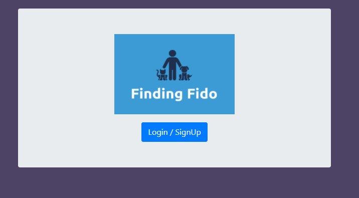
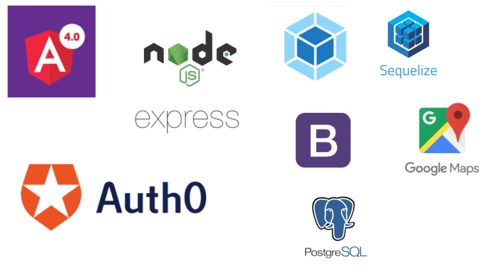

# FindingFido

> Are you an animal lover who lives in a place where you can't have a pet? 
>Are you a pet owner who can't always give your animal friend the attention they deserve? 
>Finding Fido is here to help. We find pet owners and animal lovers in the same area and help them connect to share the love.



## Team

  - __Product Owner__: Preston Winstead
  - __Scrum Master__: Lily Lebec
  - __Development Team Members__: Preston Winstead, Lily Lebec

## Table of Contents

1. [Usage](#Usage)
2. [Requirements](#requirements)
3. [Interactive Wireframe](#wireframe)
4. [Installing Dependencies](#installing-dependencies)
5. [Tech Stack](#contributing)

## Usage

> -on starting the app: 
>-npm run build in one terminal
>-npm run start in another terminal

## Requirements

- Node 0.10.x
- Angular 4.6.x
- Postgresql 9.1.x

## Interactive Wireframe

<a href= 'https://www.fluidui.com/editor/live/comment/cF8yV1AzclFiR3E4RVZpM3BWVEttNjNNSGI3eTBhV0FyaA=='>Wireframe </a>

### Installing Dependencies

From within the root directory:

```
npm install
```

## Tech Stack



